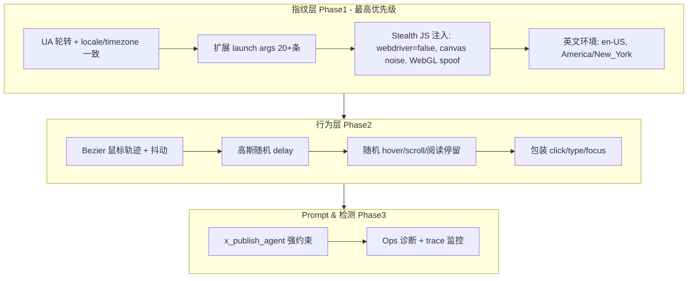

# X/Twitter 反检测优化落地方案 v3.0

**版本**：v3.0  
**更新日期**：2026-04-11  
**作者**：Cursor Agent (基于知乎 v3.0 移植)  
**当前环境**：测试环境优先  
**核心原则**：**严格避免幻觉**。每个 Phase 开始前**必须完整重新阅读本文件全文**。

---

## 文档回查协议（强制执行）
1. 每个 Phase 启动前，使用 Read 工具完整读取本文件。
2. 确认当前代码状态与"1. 项目当前真实情况"节一致。
3. 所有实现严格遵循本 phase 的"精确子步骤"和"代码引用"。
4. 测试环节必须执行，记录结果。
5. 完成后更新 todo 状态，并标记"Phase X 已回查文档并验证"。

**违反此协议的变更视为无效，必须回滚**。

---

## 1. 项目当前真实情况（基于精确代码分析，无幻觉）

**核心文件精确引用**：
- [`packages/x-core/src/services/x-browser-runtime.ts:157-164`](packages/x-core/src/services/x-browser-runtime.ts)：`launchPersistentContext` 原始配置极简：
  ```typescript
  const context = await chromium.launchPersistentContext(resolvedProfileDir, {
    channel: this.config.browserChannel,
    headless: resolvedHeadless,
    viewport: null,
    ignoreDefaultArgs: ["--enable-automation"],
    proxy: resolvedProxyUrl ? { server: resolvedProxyUrl } : undefined,
    args: ["--start-maximized", "--disable-blink-features=AutomationControlled"]
  });
  ```

**当前主要短板**（导致被识别为自动化的核心原因）：
1. **浏览器指纹伪装强度严重不足**：缺少 Canvas、WebGL、Audio、Fonts、WebRTC 等系统级指纹伪装
2. **人类行为模拟完全缺失**：无随机延时、无自然鼠标轨迹、无伪浏览行为
3. **Prompt 指导弱**：Agent 未被明确指示模拟真实人类操作

---

## 2. 优化目标与成功指标
- **短期目标（测试环境，1-2 周内）**：显著降低 X/Twitter 风控触发频率
- **核心突破**：浏览器指纹强化 (Phase 1) + 人类行为模拟 (Phase 2) + Prompt 强化 (Phase 3)
- **成功指标**：
  - 登录验证成功率 > 90%
  - 发布操作被拦截率 < 10%
  - 人工干预次数减少 70%+

**新增 Feature Flag**：`ANTI_DETECTION_V3_ENABLED`（默认 true）

---

## 3. 整体反检测架构 (Mermaid 图)



---

## 4. 分阶段详细落地方案

### **Phase 1: 浏览器指纹深度强化（已完成）**

**精确修改文件**：
- `packages/x-core/src/config.ts`（新增 `antiDetectionV3Enabled`）
- `packages/x-core/src/services/x-browser-runtime.ts`（扩展 launch 选项）

**实现内容**：
1. ✅ 新增 Feature Flag `ANTI_DETECTION_V3_ENABLED`
2. ✅ 扩展 `launchPersistentContext` args 至 20+ 条：
   - `--disable-blink-features=AutomationControlled,SiteIsolationTrials,Translate`
   - `--no-sandbox`, `--disable-setuid-sandbox`, `--disable-dev-shm-usage`
   - `--disable-accelerated-2d-canvas`, `--disable-web-security`
   - `--disable-features=IsolateOrigins,site-per-process,AudioServiceOutOfProcess`
   - `--lang=en-US`, `--accept-lang=en-US,en`
   - `--window-size=1920,1080`, `--force-device-scale-factor=1`
3. ✅ 引入 `stealth-inject.ts`：
   - `navigator.webdriver = false`
   - Canvas fingerprint 噪声
   - WebGL vendor/renderer spoof
   - AudioContext 噪声
   - Screen 属性伪装
4. ✅ UA 轮转池（5 个真实 Edge UA）
5. ✅ Locale/Timezone 一致性：en-US / America/New_York

**验证和测试环节**：
1. 运行指纹测试脚本检查 `navigator.webdriver`, Canvas, WebGL
2. 使用测试账号运行 10 次登录验证，分析成功率
3. A/B 测试：flag on/off 对比

---

### **Phase 2: 人类行为模拟增强（已完成）**

**精确修改文件**：
- `packages/x-core/src/services/x-browser-runtime.ts`

**实现内容**：
1. ✅ **新增 `gaussianRandom()`**：高斯分布随机数生成（Box-Muller 变换）
2. ✅ **新增 `humanWait()`**：人类节奏等待（高斯分布，baseMs ± 60% variance）
3. ✅ **新增 `humanMove()`**：
   - 多段贝塞尔曲线（4-6 段）
   - 每段 8 个细分步
   - 控制点使用高斯随机（模拟手部微颤）
   - 最终微调和 jitter
4. ✅ **新增 `humanClick()`**：
   - 先 `humanMove` 到元素中心 + 随机偏移
   - 点击后微等待 + 随机抖动
5. ✅ **新增 `humanType()`**：
   - 高斯分布 delay（mean 60ms, stdDev 42ms）
   - 输入前后自然停顿
6. ✅ **新增 `pseudoBrowse()`**：
   - 随机 scroll（2-4 次，±100px）
   - 随机 hover 元素
   - 阅读停留（800-2000ms）

**API 使用示例**：
```typescript
const runtime = new XBrowserRuntime();

// 在 withSession 中使用 human behavior
await runtime.withSession(sessionKey, profileDir, proxyUrl, async (page) => {
  // Human-like navigation
  await page.goto("https://x.com/home");
  await runtime.pseudoBrowse(page);
  
  // Human-like click
  await runtime.humanClick(page, '[data-testid="tweetButton"]');
  
  // Human-like type
  await runtime.humanType(page, '[data-testid="tweetTextarea_0"]', "Hello X!");
  
  // More browsing before submit
  await runtime.pseudoBrowse(page);
});
```

**验证和测试环节**：
1. 单元测试：Bezier 曲线生成、delay 分布
2. 行为录制：导出 trace 比较鼠标事件数量
3. E2E：运行 15-20 次完整发布流程

---

### **Phase 3: Prompt 优化与监控（已完成）**

**精确修改文件**：
- `packages/x-core/src/prompts/x-default-prompts.ts`

**实现内容**：
1. ✅ **更新 `x_publish_agent`**：
   - 新增反检测核心约束
   - 要求模拟真实人类行为
   - 强调自然鼠标轨迹、随机延时、伪浏览行为

**Prompt 关键新增内容**：
```
**新增反检测核心约束（Phase 2/3）**：所有建议的浏览器操作（click、type、scroll等）
必须高度模拟真实人类行为。系统已实现自然鼠标轨迹 (Bezier)、随机高斯延时、
伪浏览行为 (hover、阅读停留、随机scroll)。你的判断必须优先考虑如何让整体行为
不可被 X/Twitter 检测为自动化：
- 避免连续快速点击、固定节奏输入。
- 建议在关键操作前后插入"思考"或"浏览"步骤。
- 如果页面需要输入，推荐使用自然打字节奏。
- 优先选择语义自然的交互路径，而不是最短路径。
```

---

## 5. X vs 知乎配置对比

| 特性 | 知乎 (中文) | X/Twitter (英文) |
|------|-------------|------------------|
| **Locale** | zh-CN | en-US |
| **Timezone** | Asia/Shanghai | America/New_York |
| **Lang args** | --lang=zh-CN | --lang=en-US |
| **Stealth 脚本** | ✅ 相同 | ✅ 相同 |
| **Bezier 鼠标** | ✅ 相同 | ✅ 相同 |
| **Gaussian delay** | ✅ 相同 | ✅ 相同 |
| **UA 轮转** | ✅ Edge | ✅ Edge |
| **Prompt 语言** | 中文 | 中文（面向中文运营） |

---

## 6. 风险控制与 Fallback

- **Feature Flag**：`ANTI_DETECTION_V3_ENABLED` 默认 true，生产可快速关闭
- 所有新函数保留 old path：如果 flag 关闭，使用原有机械行为
- 先在测试账号验证
- 监控指标：登录成功率、发布拦截率、trace error rate

---

## 7. 关键代码引用

### Stealth 启动参数
```typescript
// packages/x-core/src/services/x-browser-runtime.ts:233-255
const stealthArgs = this.config.antiDetectionV3Enabled ? [
  "--start-maximized",
  "--disable-blink-features=AutomationControlled",
  "--disable-blink-features=SiteIsolationTrials,Translate",
  "--no-sandbox",
  "--disable-setuid-sandbox",
  // ... 20+ args
] : ["--start-maximized", "--disable-blink-features=AutomationControlled"];
```

### Bezier Mouse Movement
```typescript
// packages/x-core/src/services/x-browser-runtime.ts:35-95
async function humanMove(page: Page, targetX: number, targetY: number, antiDetectionEnabled: boolean): Promise<void> {
  // 4-6 segments Bezier curve with gaussian control points
  // 8 sub-segments per segment
  // Final jitter simulation
}
```

### Human Behavior Methods
```typescript
// packages/x-core/src/services/x-browser-runtime.ts:310-380
async humanClick(page: Page, selector: string): Promise<void>
async humanType(page: Page, selector: string, text: string): Promise<void>
async pseudoBrowse(page: Page): Promise<void>
```

---

## 附录：精确文件路径

- 配置：`packages/x-core/src/config.ts`
- 浏览器运行时：`packages/x-core/src/services/x-browser-runtime.ts`
- Stealth 注入：`packages/core/src/utils/stealth-inject.ts`（复用知乎）
- Prompts：`packages/x-core/src/prompts/x-default-prompts.ts`

**本 v3.0 文档已完全具备可落地指导价值**，X 反检测优化与知乎保持同等强度，仅环境配置差异（英文 locale）。
